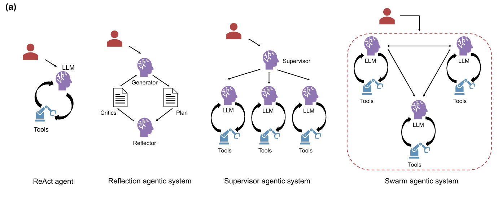

# Agent Architecture

## 1. 용어

- **DMTA**: 설계(Design)-합성(Make)-시험(Test)-분석(Analyze) 주기
- **ADMET**: 흡수(Absorption), 분포(Distribution), 대사(Metabolism), 배설(Excretion), 독성(Toxicity)
- **HTS**: 수만 개에서 수백만 개에 달하는 방대한 화합물 라이브러리를 로봇 자동화 기기를 이용해 빠르게 테스트하여, 질병 치료 효과가 있는 후보 물질(Hit)을 찾아내는 초기 신약 개발의 핵심 실험 기법입니다.

## 2. AI Agent의 핵심 구성 요소 (Agent Architecture) - Simplified

**"Agent Architecture"**는 딥러닝 모델이 "생각하고", "계획하고", "행동"하게 만드는 뼈대와 설계도를 의미합니다. 마치 인간의 뇌와 신체처럼, 이 구조들이 모여 복잡한 작업을 수행합니다.

가장 보편적이고 핵심적인 구조는 아래 네 가지로 요약할 수 있습니다.

### 2.1. LLM (Large Language Model) : "뇌" (The Brain / The Reasoner)
* **역할**: 가장 핵심적인 추론 기관입니다. 사용자의 질문을 이해하고, 방대한 지식을 검색하며, 다음 행동을 결정합니다.
* **예시**: GPT-4, Claude 3, Gemini
* **기능**:
    * **이해**: 자연어 지시사항을 분석합니다.
    * **계획**: 작업을 여러 단계로 나눕니다. ("1번 먼저 하고, 2번으로 이동")
    * **생성**: 논리적인 답변이나 코드를 생성합니다.

### 2.2. Tools / Skills / Functions : "손과 발" (The Hands & Tools)
* **역할**: LLM이 현실 세계와 상호작용할 수 있게 해주는 도구들입니다. LLM은 직접 계산하거나 검색할 수 없으므로, 이 도구들을 호출(Call)하여 사용합니다.
* **종류**:
    * **검색 도구 (Search)**: 웹 검색을 통해 최신 정보를 가져옵니다.
    * **계산 도구 (Calculator)**: 단순 산수를 정확히 처리합니다.
    * **코드 실행기 (Code Interpreter)**: Python 코드를 실행하여 데이터를 분석하거나 파일을 생성합니다.
    * **API 호출기**: 외부 서비스(주식, 날씨, 내부 DB)에 연결합니다.

### 2.3. Context / Memory : "기억력" (The Memory)
* **역할**: 이전에 나눈 대화나 처리한 결과를 기억하여 일관된 작업을 수행하게 합니다.
* **종류**:
    * **단기 기억 (Short-term/Working Memory)**: 현재 진행 중인 대화 내용입니다.
    * **장기 기억 (Long-term Memory)**: Vector DB 등을 활용하여 과거의 중요한 경험이나 문서를 저장하고 필요할 때 불러옵니다.

### 2.4. Safety & Guardrails : "안전장치" (The Brakes)
* **역할**: 에이전트가 잘못된 행동을 하거나 유해한 콘텐츠를 생성하는 것을 막습니다.
* **기능**:
    * 유해성 필터링 (Harmful Content Filtering)
    * 데이터 유출 방지 (Data Leak Prevention)
    * 윤리적 판단 (Ethical Reasoning)

## 3. AI Agent의 핵심 외부 도구 - Simplified

### 3.1. Perception tools(인지 도구) 
* **역할**: 시스템의 기능을 확장하는 계층. 정형 및 비정형 외부 데이터 소스에 접근하여 정보를 수집한다.
* **예시**:
    * **화합물/약물 데이터베이스**: CHEMBL, PubChem
    * **단백질/유전자 데이터베이스**: STRING, UniProt, SGD, Ensembl
    * **생명과학 연구 데이터베이스**: Reactome, KEGG, GO(Gene Ontology), PathwayCommons

### 3.2. Computational Tools(연산 도구)
* **역할**: 외부 데이터 소스로부터 정보를 수집한 후, 수집한 정보를 바탕으로 특정 작업을 수행합니다. 신약 개발 분야에서 예측, 시뮬레이션, 데이터 분석 또는 기타 컴퓨팅 작업을 가능하게 합니다. 이러한 도구들은 주로 AlphaFold와 같은 사전 학습된 모델이나 NextFlow와 같은 데이터 처리 파이프라인을 구동하기 위한 래퍼(wrapper) 역할을 합니다.
* **예시**:
    * **구조 예측**: AlphaFold2/3
    * **화합물 물성/독성 예측**: SwissADME, PK-Sim, PreADMET
    * **데이터 처리 및 분석 워크플로우**: NextFlow, Snakemake
    * **화학 구조/반응 데이터베이스**: ZINC, ChEMBL, Reaxys
    * **분자 도킹 및 가상 스크리닝**: AutoDock Vina, DOCK, Glide
    
### 3.3. Action Tools(행동 도구)
* **역할**: 에이전틱 시스템이 현실 세계에서 물리적으로 행동할 수 있는 능력을 제공합니다. 예를 들어, 에이전틱 시스템은 로봇 피펫팅, 자동화된 세포 기반 분석 또는 차세대 염기서열 분석(NGS) 라이브러리 준비 장비에 연결되어 물리적인 작업을 실행합니다. 이러한 행동 도구는 컴퓨터를 이용한 가상 설계(in silico)와 실제 경험적 검증 사이의 루프(순환 과정)를 견고하게 완성해 줍니다.
* **예시**: 
    * **화학 합성 로봇**: Chematica, Synthia
    * **실험 자동화 시스템**: Hamilton STAR, Tecan Freedom EVO
    * **세포 분석 및 이미징 장비**: High-content screening (HCS) platforms
    * **유전체 시퀀싱 장비**: Illumina NovaSeq, PacBio Sequel

### 3.4. Memory Tools(메모리 도구)
* **역할**: 에이전트의 작업 지식을 저장, 검색, 압축 및 업데이트하여 여러 작업과 세션 전반에 걸쳐 정보의 지속성을 유지합니다. 신약 개발 환경에서 메모리 데이터베이스는 SAR(구조-활성 관계) 패턴, 축적된 독성 발견 결과 및/또는 반복적으로 재사용되는 기타 고부가가치 지식을 기록할 수 있습니다. 이 메모리 계층은 다단계 추론 과정에서 맥락을 유지시켜 주어, 시스템이 시간이 지남에 따라 가설을 점점 더 정교하게 다듬을 수 있도록 합니다.
* **예시**:
    * **벡터 데이터베이스**: Pinecone, Milvus, Chroma
    * **관계형 데이터베이스**: PostgreSQL, MySQL
    * **지식 그래프**: Neo4j, Amazon Neptune

## 4. AI Agent Architecture

Seal et al(2026)의 AI Agent Architecture

### 4.1. ReAct agent
해당 Framework는 LLM이 **Reasoning(추론)**과 **Action(행동)**을 번갈아 수행하면서 작업을 해결해 나가는 방식이다. LLM은 필요한 도구를 동적으로 선택하고 실행하게 되며, **반복적인 루프(iteration loop)**을 통해 문제를 해결하며, 인간의 개입을 최소화하고 프로세스를 언제 종료할지 스스로 판단합니다.
이 방법은 신약 개발의 DMTA 주기를 모방합니다.

### 4.2. Reflection Agentic System
여러 에이전트가 연결되어 서로 소통하며 추론을 평가(평가)할 수 있도록 고안된 프레임워크입니다. 해당 아키텍처는 토론과 전략적 계획이 필요한 작업에 효과적입니다. 예를 들어, 다단계 합성 경로를 게획하거나 고속 대량 스크리닝(HTS)을 위한 실험 워크플로우를 설계하는데 적용할 수 있습니다.

### 4.3. Supervisor Agentic System
작업 위임에 집중하는 한 명의 supervisor agent와, supervisor agent가 위임한 작업을 수행하는 export agent들로 구성되어 있습니다. 작업은 sub-task로 분해되어 각 expert에 위임되고, 취합된 결과는 다시 supervisor agent에 의해 재구성되어 루프를 수행합니다.
**주의**: 모든 작업의 결과가 supervisor로 넘겨지마, context-window의 큰 영향을 받게 됩니다.

### 4.4. Swarm Agentic System
수퍼바이저 에이전트의 역할을 분산시키며, 각 에이전트는 모든 에이전트와 연결되고 협력을 촉진합니다. 

### 예시: "주식 투자 분석 에이전트"의 구조

만약 위에서 설명한 **"신약 개발 에이전트"**가 특정 기능을 수행하는 에이전트라면, 그 구조는 아래와 같이 구체화될 수 있습니다.

| 구성요소 | 역할 | 신약 개발 에이전트에서의 예시 |
| :--- | :--- | :--- |
| **LLM (뇌)** | 계획 및 추론 | "특정 질병의 타겟 발굴 단계를 진행하자."고 결정하고 지시. |
| **Tool 1 (검색)** | 정보 획득 | **"PubMed API"**를 호출하여 최신 논문을 검색. |
| **Tool 2 (코드 실행)** | 데이터 분석 | **"Python 환경"**에서 검색된 논문의 데이터를 분석하거나 그래프 생성. |
| **Tool 3 (DB 연동)** | 내부 지식 활용 | **"화합물 라이브러리 DB"**에서 후보 물질 정보를 조회. |
| **Context (기억)** | 히스토리 유지 | "이전에 분석했던 A 타겟에 대한 논문들과, 현재 보고 있는 B 화합물의 구조"를 기억하며 연결. |
| **Safety** | 윤리/규정 준수 | 임상시험 데이터 관련 규제나 윤리적 이슈를 점검. |

이 구조 덕분에 에이전트는 단순히 글을 쓰는 것을 넘어, **계획을 세우고(LLM), 필요한 도구를 사용하며(Tools), 과거를 기억하여(Memory), 안전하게(Safety)** 복잡한 과학적 작업을 수행할 수 있게 됩니다.

---

