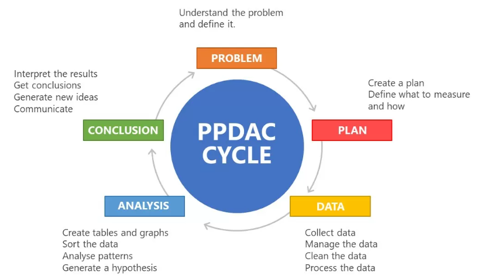
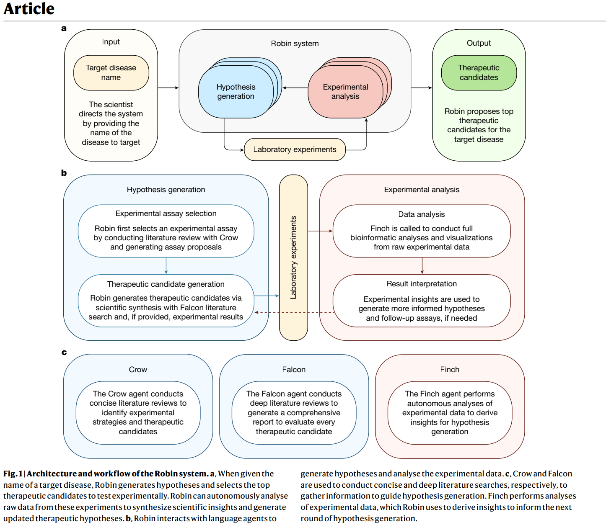
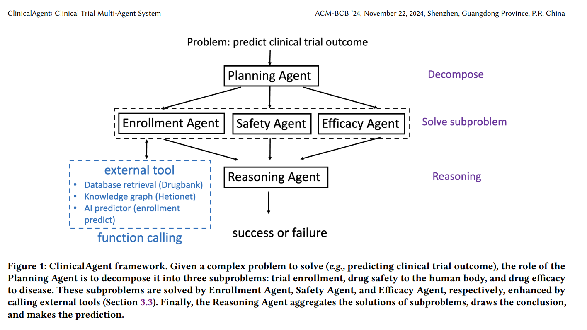

# 데이터 분석 자동화 에이전트

* 작성일: 2026.07.26
* 작성자: 서형민
* 목적: 데이터 분석 자동화 에이전트의 개발 전, 사전 조사한 내용을 정리한 문서.

# 요약

대회 내용.md에 나와있는 주제 중 주요 연구 내용(예시)는 특정 논문과 그 내용이 대응되는 것을 확인할 수 있었다.
- 분야 1(자율형 가설 생성 및 검증): 타겟 발굴·재창출·바이오마커 예시는 Robin(Nature, 2026), OriGene, BioScientist Agent, PandaOmics와 정확히 겹친다.
- 분야 2(도구 활용 기반 분자 최적화 루프): 구조 최적화·합성경로·유사성 개선 예시는 MolClaw, AgentDrug, RetroAgent, onepot.ai와 겹친다.
- 분야 3(규제 대응 및 지능형 임상 설계): 프로토콜 설계·가이드라인 준수·실패 리스크 예시는 ClinicalAgent, RAG 규제준수 시스템, AgentMD와 겹친다.

즉, 주요 연구 내용(예시)는 해당 분야에서 어떤 종류의 작업이 이루어지는지 보여주는 참고 예시일 뿐이다.
예시와 같은 카테고리 내에서, Robin과 같이 "모든 질병에 대한 범용 가설생성"이 아니라 "특정 분야에 한정된 가설생성 미니 파이프라인"처럼 스코프를 좁히거나, 혹은 기존 시스템의 특정 약점을 개선하는 방향으로 차별화해야 한다.

분야 1은 

그러기 위해서는 특정 데이터셋에 대한 조사를 더 수행해야 할 것 같다.

# 목차

- [프로젝트의 목적](#목적)
- [필요성에 대한 내용](#필요성에-대한-내용)
    - [실무자들의 데이터 분석 과정과 파이프라인에 대한 조사](#1)
        - [통계학적/실증적 데이터 분석자의 관점](#1-1)

# 목적

데이터 분석 자동화 에이전트를 개발하고자 하는 이유는 다음과 같다:
- 비전문가인 내가 시작하기 가장 좋아 보이기 때문

# 필요성에 대한 내용

계획서를 작성하기 전, 필요성에 대한 탐구가 필요하다. 
탐구 내용은 다음과 같다:
1. 실무자들의 데이터 분석 과정과 파이프라인에 대한 조사
    - 어떤 종류의 데이터를 다루는지
2. 데이터 분석 자동화의 현황 조사
    - 어떤 솔루션이 있는지
    - 어떤 기술 스택이 사용되는지
3. 데이터 분석 자동화로 해결하고자 하는 문제점
    - 

## 1. 실무자들의 데이터 분석 과정과 파이프라인에 대한 조사

### 용어 설명

- **SAP(사전 분석 계획)**: 임상시험을 시작하기 전에 "무엇을 측정하고 어떤 방법으로 검정할지"를 미리 문서로 확정해두는 것.
- **배치효과(Batch Effect)**: 같은 실험이라도 실행 시점·시약 로트·실험실 조건 차이로 측정값에 생기는 체계적인 오차.
- **BEE / BEC**: 배치효과가 얼마나 있는지 평가(Evaluation)하고, 수학적으로 제거(Correction)하는 절차. ComBat은 이 보정에 널리 쓰이는 통계 기법 이름.
- **다중비교보정(MCP)**: 비교를 여러 번 할수록 우연히 유의미해 보이는 결과가 나올 확률이 높아지는 문제를 막기 위한 통계적 보정(복권을 여러 장 살수록 하나쯤 당첨될 확률이 오르는 것과 비슷한 원리).
- **위양성률(False Positive Rate) / 위발견율(FDR)**: 실제로는 차이가 없는데 있다고 잘못 판단하는 비율.
- **IC50 / EC50**: 화합물이 효과의 절반을 내는 농도. 신약 후보물질이 얼마나 강력한지 나타내는 대표 지표.

### 1-1. 일반적 데이터 분석자의 관점

통계학자들의 데이터 분석 과정을 정형화한 대표적인 모델은 **PPDAC 사이클**이다. Wild & Pfannkuch(1999)가 통계학자들의 사고 과정을 관찰해 정립했고, Spiegelhalter의 *The Art of Statistics*를 통해 대중화되었다.
 
- **Problem**: 무엇을 측정할 것인가를 정의
- **Plan**: 어떻게 측정/수집할 것인가를 설계
- **Data**: 수집한 데이터의 품질을 점검
- **Analysis**: 데이터로 질문에 답함
- **Conclusion**: 결과를 한계까지 포함해 보고
이 사이클의 핵심은 선형이 아니라 **반복적(iterative)** 이라는 점이다. Analysis 단계에서 데이터 품질 문제가 발견되면 Data 단계로, Conclusion 단계에서 예상 밖의 결과가 나오면 Problem 단계로 되돌아간다.

해당 사이클 내에서 다시 두 부분으로 나눠지는 것이 Tukey(1977, *Exploratory Data Analysis*)의 핵심 통찰이다.

**탐색적 데이터 분석(EDA, Exploratory Data Analysis)**: 데이터를 들여다보며 그럴듯한 가설을 "제안"하는 단계.
**확증적 데이터 분석(CDA, Confirmatory Data Analysis)**: EDA 가설을 귀무/대립 가설로 만들고 "검증"하는 단계. Tukey는 이 둘을 같은 데이터셋에 섞어 쓰면(데이터를 보고 가설을 세운 뒤, 같은 데이터로 그 가설을 검정) 체계적 편향(bias)이 생긴다고 경고했다.

다만 에이전트가 EDA와 CDA를 모두 수행해버리면 다음과 같은 문제가 발생할 수 있다:
**p-hacking & HARKing**: p-hacking은 통계적 유의성(p < 0.05)을 얻기 위해 데이터를 여러 번 분석하면서 유의미한 결과를 선택하는 행위이다. HARKing(Hypothesis After the Results are Known)은 분석 결과를 보고 나서 가설을 세우는 행위로, p-hacking의 주요 원인 중 하나이다.
**재현성 위기**: 바이오 및 신약개발 및 의학 분야에서 연구 결과가 타 연구나 다른 데이터셋에서 재현되지 않은 주요 원인

업계에서는 이 워크플로우가 두 가지 표준 프레임워크로 정형화되어 있다.에이전트 설계에서 어떤 순서 루프를 돌며 자동화를 수행해야할 지 참고할 수 있을 것이다.

- **CRISP-DM**(Cross-Industry Standard Process for Data Mining, 1996): Business Understanding → Data Understanding → Data Preparation → Modeling → Evaluation → Deployment의 6단계 순환 프로세스.
    - Data Preparation이 전체 프로젝트 시간의 약 80%를 차지한다는 것이 업계에서 널리 인용되는 경험칙이다.
- **OSEMN**(2010): Obtain → Scrub → Explore → Model → iNterpret. 
    - CRISP-DM보다 가볍고, 데이터 사이언티스트 실무자 관점에 더 가깝다.

즉 실증분석자의 파이프라인은 **데이터 발견 → 정제(wrangling) → 프로파일링 → (EDA로 가설 생성) → 모델링/검정(확증적 분석) → 보고**의 흐름을 반복적으로 오간다. 에이전트가 이 관점을 지원하려면 "가설을 생성하는 것"과 "생성된 가설을 통계적으로 검증하는 것"이 서로 다른 단계이며 서로 다른 방법론을 요구한다는 점을 구분해서 설계해야 한다.
 
### 1-2. 신약개발/바이오파마 맥락에서의 통계 분석가 관점
 
신약개발 분야의 통계학적 분석가는 위 일반 워크플로우를 그대로 따르되, 크게 두 지점에서 일반 데이터 분석과 달라진다.
 
1. **사전 명시된 분석 계획(Statistical Analysis Plan, SAP)의 비중이 크다.** 

임상시험 데이터는 EDA와 CDA 분리를 규제로 강제한다.
- 1차/2차 평가변수와 검정 방법을 임상시험 개시 전에 미리 확정(pre-specification)해, 데이터를 본 뒤 가설을 바꾸는 것을 원천 차단한다. Tukey의 EDA/CDA 분리 원칙이 규제 요건으로 제도화된 사례로 볼 수 있다.
- 예시) "6개월 후 종양 크기 감소율를 측정하고, 이 통계 방법으로 검정하겠다."를 미리 문서화하 한다는 점.

2. **QC와 배치효과 보정이 분석의 상당 부분을 차지한다.** 

- 오믹스·HTS처럼 대규모 배치로 생성되는 데이터는 배치효과 보정이 분석의 큰 비중을 차지한다. 
- 배치 간 체계적 편향(batch effect)이 생물학적 신호를 가릴 수 있어, 정식 분석에 앞서 배치효과 평가(BEE, Batch Effect Evaluation)와 보정(BEC, Batch Effect Correction)을 거친다.
- QC 샘플 기반 보정(LOESS, 선형모델), 또는 ComBat 같은 데이터 기반 보정 기법이 널리 쓰이지만, 2단계 보정이 하위 분석의 위양성률(false positive rate)과 위발견율(FDR)을 과대추정하게 만들 수 있다는 점도 알려진 함정이다.

**실무에서 다루는 대표적 분석 유형**
 
- **용량-반응(Dose-Response) 분석**: HTS·assay 결과를 시그모이드 곡선에 피팅해 IC50/EC50을 산출. R의 `IncucyteDRC` 같은 전용 패키지가 이 워크플로우를 표준화하고 있다.
- **다중비교 보정(Multiple Comparison Procedure, MCP)**: 전임상 실험에서 여러 처리군을 동시에 비교할 때, 비모수 검정과 함께 다중검정 보정을 적용해 위양성을 통제한다.
- **임상시험 통계 분석**: Phase 1~4에 걸쳐 임상시험 설계, 평가변수 설정, 통계적 유의성 확보를 담당.

**주로 사용하는 기술 스택**: SAS(FDA 제출용 임상 데이터 분석의 사실상 표준), R(오픈소스 생물통계·오믹스 분석), Python, SPSS, STATA, SQL. 규제 제출(FDA 등)을 다루는 전통적 생물통계 직무는 SAS 비중이 특히 높고, 탐색적,전임상 연구 단계에서는 R/Python 비중이 높아지는 경향이 있다.
 
### 1-3. 요약
 
- PPDAC 사이클이나, 정형화된 워크플로우를 사용하여 데이터 분석을 자동화하는 것이 좋겠다.
- 에이전트는 EDA와 CDA를 혼동해서는 안 된다 — "데이터를 보고 가설을 제안하는 모드"와 "사전에 고정된 가설을 검정하는 모드"를 구분해 사용자에게 명시적으로 알려줘야 한다.
- 배치효과와 QC 보정은 분석 이전에 거쳐야 하는 전처리 단계로 설계하는 것을 고려한다.
- SAP처럼 사전에 고정된 분석 계획이 존재하는 경우, 에이전트가 임의로 분석 방법을 바꾸지 않도록 제약이 필요하다며, 사람이 계획을 승인 및 변경하는 HITL 설계가 요구된다.

## 2. 다루고자 하는 데이터의 종류에 대한 조사

에이전트를 개발하기 전, 특정 도메인에 대한 조사와 병행한다. 
어떠한 데이터를 다루는지에 대해 가정과 설계가 달라질 것이라고 생각한다.

### 2-1. 데이터 카테고리

신약개발 파이프라인의 각 단계는 성격이 전혀 다른 데이터를 만들어낸다. 데이터 분석 자동화 에이전트가 실무자를 도우려면 최소한 다음 5가지 데이터 유형을 다룰 수 있어야 한다. 또한 해당 데이터셋은 여러 단계에 걸쳐 재사용되기에 시스템이 해당 데이터셋을 통합적으로 다룰 수 있는 것이 좋아 보인다.
 
- **오믹스(Omics)**: 유전체·전사체(RNA-seq)·단백질체 등 생물학적 정보. 주로 타겟이 질병과 어떤 관계인지 규명하는 초기 단계에서 쓰인다.
- **이미지**: 세포·조직 이미지 데이터. 대표적으로 Cell Painting은 세포 내 여러 구성요소를 염색해 대량의 형태학적 정보를 얻는 기법으로, 딥러닝 기반 활성·독성 예측과 작용기전 추론에 쓰인다.
- **활성평가 결과(Assay Readouts)**: 화합물 농도별 반응을 측정한 정량 데이터. 이 값을 곡선으로 피팅해 IC50/EC50(1-1 참고)을 산출한다.
- **약동학(PK) 데이터**: 약물 투여 후 시간에 따른 혈중농도 데이터. NCA로 Cmax, Tmax, AUC, 반감기 같은 핵심 지표를 계산한다.
- **임상 결과 데이터**: 임상시험 평가변수·이상반응 데이터와, 최근 보완적으로 쓰이는 RWD/RWE(전자의무기록·청구데이터 기반).

각 데이터 유형은 형식과 규모, 노이즈 특성이 상당히 달라서, 앞서(1-1) 다룬 배치효과 및 QC 문제도 유형마다 다르게 나타난다. 따라서 에이전트가 데이터 유형을 먼저 식별하고 그에 맞는 전처리 및 분석 파이프라인을 선택하는 것이 자동화 설계의 출발점이 된다.

신약개발 파이프라인 단계별 데이터 유형 및 분석 유스케이스 요약.

Usecase | 단계 | 주로 사용하는 데이터의 유형|
| --- | --- | --- |
| 가설 생성 | 타겟 발굴, 일부 임상(바이오마커) | 오믹스 + 문헌/지식그래프(ChEMBL·PubChem 등) + 일부 임상결과 |
| 분자구조 최적화 | Hit Discovery ~ Lead Optimization | Assay Readouts(SAR/potency) + 화학구조 데이터 + PK/ADMET 예측치 |
| 규제 대응 및 지능형 임상 설계 | 전임상~임상 | 임상결과 데이터 + PK 데이터 + 규제 가이드라인 문서(텍스트) + 과거 임상시험 이력 |

### 2-2. 모달리티(Modality)와 데이터 유형 통합 조사

# 신약 개발 모달리티 종합 정리

모달리티는 치료제가 어떤 물질적 형태와 작용 방식을 갖는지를 가리킨다. 그 예시로는 다음과 같다:
- 저분자 화합물
- 항체/단백질 치료제
- 유전자 치료제
- 세포 치료제

| 데이터 유형 | 저분자 화합물 | 항체/단백질 치료제 | 유전자치료제 | 세포치료제 |
|---|---|---|---|---|
| 오믹스 | 타겟 발굴용 유전체/전사체 분석, LINCS L1000 교란 프로파일 | 타겟 발굴은 공통, 에피토프 매핑에 프로테오믹스 활용 | 타겟 발굴 + 편집/전달할 서열 자체 설계에 사용 | 타겟 발굴 + 세포 표현형 분류에 활용 |
| 이미지 | Cell Painting 등 고함량 표현형 스크리닝(JUMP-CP: 116,750개 화합물, 1.6억 세포, 115TB) | 조직 발현 패턴 면역조직화학(IHC) 이미지 | 벡터 생체분포·형질도입 발현 이미지 | 세포 추적·조직 침윤 이미지 |
| 활성평가 | IC50/EC50/Ki(효소저해·결합), BAO/ChEMBL 표준 온톨로지로 정규화 | SPR/BLI 결합친화도 + ADCC/CDC 기능평가 | 형질도입 효율, 유전자 편집 효율(qPCR) | 세포독성, 사이토카인 분비, 종양살상능 |
| 약동학 | 고전적 PK(CYP450 대사, 경구흡수, 반감기·청소율) | FcRn 재순환, 표적매개약물처리(TMDD)로 비선형 PK | 벡터 생체분포·배출(shedding), qPCR 기반(정량한계 50 copies/μg gDNA) | "세포동태학"(cellular kinetics): 분포·증식·수축·지속성(DECP), ddPCR/유세포분석 |
| 임상 데이터 | CDISC SDTM/ADaM 표준, 전통적 안전성·유효성 엔드포인트 | 동일 CDISC 골격, 면역원성 모니터링 추가 | CDISC-Embleema가 유전자·세포치료제 전용 표준 개발 중(공식 표준 미완성) | 지속성·확장성 지표가 핵심 엔드포인트로 추가 |

## 1. 모달리티 분류

| 모달리티 | 정의 |
|---|---|
| 저분자 화합물 | 분자량 900 Da 이하 합성 유기화합물 |
| 항체/단백질 치료제 | 단클론항체, 이중특이항체, 융합단백질 등 대형 생체고분자 |
| ADC(항체-약물접합체) | 항체에 세포독성 약물을 결합 |
| RNA 치료제 | mRNA, siRNA(RNAi), 안티센스올리고뉴클레오타이드(ASO) |
| 펩타이드 | 저분자·biologics 중간 성격(GLP-1 계열 등) |
| 표적단백질분해제(PROTAC 등) | 표적 단백질을 세포 내 분해 경로로 유도 |
| 유전자치료제 | AAV·렌티바이러스 등 벡터로 DNA 전달 |
| 세포치료제 | CAR-T 등 살아있는 세포 자체를 조작해 투여 |
| 방사성리간드치료제 | 방사성동위원소를 리간드에 결합 |
| 백신 | 항원/mRNA 기반 예방·치료 제제 |

## 2. 모달리티별 특징 · 데이터 형식 · 데이터셋

| 모달리티 | 특징 | 데이터 형식 | 주요 데이터셋/관리표준 |
|---|---|---|---|
| 저분자 | 세포막 투과 용이, 경구투여 가능, 표적 포켓 맞춤 최적화 | SMILES/InChI, 분자그래프, 3D 도킹좌표, IC50/EC50 | ChEMBL(~150만 SMILES), ZINC20(수억 화합물), BAO 온톨로지로 활성값 정규화 |
| 항체/단백질 | 표적특이성 높음, 경구불가(주사 투여), 세포배양 생산 | FASTA 서열, CDR 루프, PDB 구조, SPR 결합데이터 | Observed Antibody Space(~24억 unpaired 서열, AIRR표준), SAbDab/Thera-SAbDab(치료용 항체 850+종) |
| 유전자치료제 | DNA/RNA 전달로 유전정보 자체 교정, 벡터 생체분포·면역원성이 리스크 | 캡시드 서열, qPCR 벡터 카피수, cryo-EM 구조 | AAV2 캡시드 변이 라이브러리, cryo-EM 구조 라이브러리(~150개), FDA 생체분포 가이드라인 |
| 세포치료제 | 살아있는 세포 자체가 약물, 증식·지속성이 효과 좌우 | scRNA-seq, 유세포분석 FCS 파일, ddPCR 정량값 | FlowRepository(MIFlowCyt표준), GEO, Stanford CAR-T 단일세포 저장소 |

공통적으로 오믹스(타겟발굴)·이미지(표현형/생체분포)·활성평가·약동학(또는 세포동태학)·임상데이터라는 5개 카테고리를 모든 모달리티가 거치지만, 각 카테고리 안의 실제 스키마·단위·모델은 모달리티마다 별도로 구축해야 한다. 특히 약동학은 저분자(CYP450 대사)·항체(FcRn 재순환, TMDD)·세포치료제(분포·증식·수축·지속성=DECP)가 근본적으로 다른 개념을 쓴다. 임상데이터는 CDISC SDTM/ADaM이 구조적 골격을 공통 제공하나, 유전자·세포치료제 전용 표준은 아직 개발 중이다.

## 3. 시장 규모(2025년 기준, 출처 간 편차 있음)

| 모달리티 | 시장 비중/규모 |
|---|---|
| 저분자 | 전체 제약시장의 약 54~60% (매출 기준), FDA 신규승인의 65% |
| 항체 등 biologics | 전체의 약 27~35%, 시장규모 4,870억~6,260억 달러, FDA 신규승인의 20% |
| ADC | 125억~169억 달러 |
| RNA 치료제 | 85.5억 달러(2034년 261억 달러 전망) |
| 세포·유전자치료제 | 89억~232억 달러(추정치 편차 큼), 세포치료:유전자치료 비중 약 66:34 |

전체 제약시장은 2025년 약 1.77조 달러 규모다. 저분자가 과반을 차지하며 최근 비중이 오히려 상승 중이라는 방향성은 여러 출처에서 일치한다.

## 4. 기존 에이전트의 모달리티 전문화

| 에이전트 | 전문 모달리티 | 비고 |
|---|---|---|
| Robin(FutureHouse) | 저분자 — 가설생성/재창출 | dAMD용 리파수딜 발굴, Nature 2026 |
| ChemCrow, DrugAgent, ChatInvent | 저분자 — 합성/ML자동화/분자설계 | ChatInvent는 AstraZeneca 실배포 사례 |
| ClinicalAgent | 모달리티 무관 — 임상시험 결과예측 | EHR/프로토콜 기반이라 특정 화학·생물 지식에 덜 의존 |

이름이 알려진 에이전트 대부분이 저분자에 몰려 있는 이유는 도킹점수·ADMET처럼 빠르고 계산 가능한 검증 신호와 성숙한 데이터(ChEMBL, ZINC)가 있기 때문이다. 항체·유전자·세포치료제는 데이터 표준화가 덜 되어 있어 전문 에이전트 사례가 뚜렷하지 않다.

**요약**
- 멀티모달 데이터를 처리할 수 있어야 할 것 같다. 
- 각 데이터 유형에 따라 다른 전처리 및 분석 파이프라인을 선택하는 것이 중요할 것으로 보인다. 
- 전처리 단계에서 품질 관리를 수행하는 것이 중요하다. 

---

## 3. 데이터 분석 자동화의 현황 조사
 
우리의 목표를 한 발 앞서 나아가 사용되고 있는 기술에 대한 조사이다.
그 중에서 대표적인 기술에 한하여 목적과 아키텍처를 조사하여 참고하고자 한다.

### 3-1. 실제 사용하고 있는 도구에 대한 조사
 
각 유스케이스(1-3 참고)마다 이용되고 있는 대표 에이전트와 도구는 아래 표와 같다.
 
| Usecase | Name | Description |
| --- | --- | --- |
| 가설 생성 | Robin | 문헌검색 에이전트(Crow, Falcon)와 데이터분석 에이전트(Finch)를 결합해 가설 생성과 실험 설계, 결과 분석을 자율적으로 반복. dAMD 치료제로 리파수딜(Ripasudil)을 제안하고 실험실 검증까지 수행(*Nature*, 2026) |
| 가설 생성 | OriGene | 가상 질병생물학자 역할을 수행하는 self-evolving 멀티에이전트. 간암 타겟 GPR160, 대장암 타겟 ARG2를 실험적으로 검증 |
| 가설 생성 | BioScientist Agent | 10억 개 규모 사실을 담은 생의학 지식그래프(RTX-KG2) 위에서 강화학습 기반 actor-critic 알고리즘으로 약물 재창출 경로를 탐색 |
| 가설 생성 | PandaOmics | Insilico Medicine이 개발한 상용 타겟 및 바이오마커 발굴 플랫폼 |
| 가설 생성 | Plex Research (focal graph) | 지식그래프에서 질의와 관련된 부분그래프(focal graph)만 추출해 Wnt 경로의 신규 종양 타겟(eIF2 복합체 등) 발굴 |
| 가설 생성 | Augmented Nature | MCP 기반 Supervisor 구조로 SMA(척수성근위축증) 재창출 후보를 수 시간 내 도출 |
| 분자 최적화 루프 | MolClaw | 계층적 스킬(hierarchical skills)을 갖춘 자율 에이전트로 약물 분자의 평가·스크리닝·최적화를 수행 |
| 분자 최적화 루프 | AgentDrug | 제로샷(zero-shot)으로 분자 구조를 편집하는 에이전틱 워크플로우 |
| 분자 최적화 루프 | RetroAgent | 역합성(retrosynthesis) 경로 설계에 특화된 에이전트 |
| 분자 최적화 루프 | Darwin–Gödel Drug Discovery Machine (DGDM) | 스스로 알고리즘을 개선해나가는 self-improving 신약 발굴 프레임워크 |
| 분자 최적화 루프 | onepot.ai | 역합성 엔진 + 로봇팔 + LC/MS를 결합해 상업 운영 중인 소분자 합성 자동화 시설(7개 반응 유형, 일 수십 개 화합물 처리) |
| 규제 대응 및 지능형 임상 설계 | BERTox (FDA) | FDA가 심사관과 연구자의 임상시험 정보 처리를 지원하기 위해 실험 중인 LLM 기반 도구 |
| 규제 대응 및 지능형 임상 설계 | RAG 기반 규제 준수 평가 시스템 | RAG로 임상시험 프로토콜과 약물 정보 문서가 규제 가이드라인을 준수하는지 평가하는 연구용 시스템 |
| 규제 대응 및 지능형 임상 설계 | ClinicalAgent (CT-Agent) | 실사용데이터와 프로토콜 추론을 결합한 멀티에이전트로 임상시험 결과 예측 성능을 베이스라인 대비 AUC 0.33 개선 |
| 규제 대응 및 지능형 임상 설계 | AgentMD | 대규모 임상 도구 학습(tool learning)을 통해 리스크 예측을 수행하는 언어 에이전트 |

### 3-2. Robin에 대한 조사
 
- **개발**: FutureHouse. *Nature*(2026.05.19) 게재, 프리프린트 arXiv:2505.13400. 코드 공개(github.com/Future-House/robin).
- **출저**: https://www.nature.com/articles/s41586-026-10652-y
- **아키텍처**: 3개의 전문 에이전트로 구성된 파이프라인

  - 시스템 입력:
    - 초기 입력 (질병 이름): 연구자가 목표로 하는 대상 질병의 이름(예: 건성 연령관련 황반변성, dAMD)을 시스템에 입력하는 것으로 시작됩니다.
    - 실험 데이터 입력: 이후 가설에 따라 인간 연구자가 실제 실험을 수행한 뒤, 가공되지 않은 원시 실험 데이터(예: 유세포 분석용 .FCS 파일, RNA-seq 유전자 카운트 데이터)와 원하는 분석 방식을 지시하는 프롬프트를 추가로 업로드합니다.
  - **Crow**: PaperQA2 기반의 빠른 문헌 요약 에이전트.
  - **Falcon**: PaperQA2 기반의 심층 문헌 분석 에이전트.
  - **Finch**: RNA-seq, flow cytometry 등 RNA 시퀀싱(RNA-seq) 데이터와 세포의 특성을 측정하는 유세포 분석(Flow Cytometry) 데이터를 분석하는 전담 데이터분석 에이전트.
  - 이 세 에이전트가 가설 생성 → 실험 제안 → (사람이 실제 실험 수행) → 결과 데이터 분석 → 가설 갱신의 반복 루프를 돈다("lab-in-the-loop", 사람이 실험 실행을 담당하는 반자율 구조).

- **목적/목표**: 배경조사, 가설생성, 실험, 데이터분석으로 이어지는 과학적 발견의 전 과정을 하나의 워크플로우로 자동화한 최초의 멀티에이전트 시스템. 신약 재창출 후보를 스스로 제안하고 실험으로 검증하는 것이 목표.
- **구현 방식**: LLM judge(Claude 3.7 Sonnet 등)가 여러 가설을 쌍대비교(pairwise comparison)로 순위화. 재현성 확보를 위해 강화학습·합의 기반(consensus-driven) 분석을 결합.
- **사용 도구/데이터**: 문헌 DB, RNA-seq/flow cytometry 실험 데이터, LLM judge.
- **성과**: 건성 노인성 황반변성(dAMD) 치료제로 리파수딜(Ripasudil, ROCK 억제제)을 제안·검증(망막색소상피 식세포작용 증가), 후속 RNA-seq 분석으로 ABCA1 상향조절이라는 신규 기전까지 규명. 특발성 폐섬유증·근감소증 등 10개 이상 질환에 걸쳐 확장 검증됨.
- **한계**: 실험실 프로토콜 실행은 여전히 사람이 번역·수행해야 함. 프롬프트 엔지니어링 의존도가 높고, 3차원 구조 데이터는 아직 미반영.

### 3-3. ClinicalAgent(CT-Agent)에 대한 조사
 
- **개발**: Ling Yue, Sixue Xing, Jintai Chen, Tianfan Fu (arXiv:2404.14777, ACM BCB 2024 발표).
- **출저**: https://arxiv.org/abs/2404.14777
- **목적/목표**: 임상시험 데이터에 대한 접근성과 활용도를 높여, 임상시험 결과(유효성, 안전성, 환자모집 등) 예측 성능을 개선하는 것이 목표.
- **아키텍처**: 병원의 전문의 팀처럼, 약물정보 조회, 질병 분석, 설명적 추론 등 역할이 나뉜 전문 에이전트들이 협업하는 멀티에이전트 구조.

- **입력**: ClinicalAgent가 임상 시험 결과를 예측하기 위해 사용자로부터 받는 핵심 입력 데이터(Feature)는 다음과 같습니다.
    - 약물 (Drug): 예) Aggrenox capsule
    - 질병 (Disease): 예) 뇌혈관 질환(cerebrovascular accident)
    - 포함 기준 (Inclusion criteria): 임상 시험 참여 환자의 조건
    - 제외 기준 (Exclusion criteria): 임상 시험 참여에서 배제되는 환자의 조건
- **구현 방식**: GPT-4를 기반으로 **LEAST-TO-MOST**(복잡한 문제를 하위 문제로 쪼개 순차적으로 해결) 프롬프팅과 **ReAct** 추론을 결합. 표준 프롬프트 방식 대비 외부 최신 의료 데이터 접근성을 크게 높인 것이 핵심 개선점.
다중 에이전트가 복잡한 문제를 다음 3가지 하위 문제로 분해합니다. 
    - 환자 등록 가능성
    - 인체에 대한 약물 안정성
    - 질병에 대한 약물 효능
- **사용 도구/데이터**: 임상시험 데이터베이스, 약물 정보, 실사용데이터(RWD).
- **성과**: 임상시험 결과 예측에서 PR-AUC 0.7908 달성 — 표준 프롬프트 방식 대비 0.3326 개선.

### 3-4. PandaOmics에 대한 조사
 
- **개발**: Insilico Medicine. Pharma.AI 스위트의 일부로 상용 서비스 중. 논문은 *Journal of Chemical Information and Modeling*(2024, DOI: 10.1021/acs.jcim.3c01619) 게재.
- **출저**: https://pubs.acs.org/doi/10.1021/acs.jcim.3c01619
- **목적/목표**: 멀티오믹스·의생명 텍스트 데이터를 결합해 치료 타겟과 바이오마커 후보를 발굴·순위화하는 것이 목표. 실제 in vitro/in vivo 검증까지 이어진 사례들이 보고됨.
- **아키텍처**: 클라우드 기반 플랫폼으로, 오믹스 데이터 웨어하우스와 텍스트 마이닝 엔진이 결합된 구조. 최근에는 **PandaClaw**라는 agentic 레이어가 추가되어, Agent Core + LangChain/LangGraph 오케스트레이션 + 140개 이상의 과학적 스킬 + 1,000개 이상의 바이오인포매틱스 도구로 확장됨(자연어 명령으로 타겟 발굴 워크플로우 실행 가능).
- **구현 방식**: 유전자·경로 스코어링에 자체 개발한 **iPANDA** 알고리즘군(*Nature Communications* 게재 이력) 사용. 23개의 질병별 머신러닝 모델로 유전자별 연관성을 스코어링. NLP 엔진이 특허·논문·연구비·임상시험 DB 등 수백만 건의 텍스트를 분석해 타겟의 신규성(novelty)과 질병 연관성을 평가.
- **사용 도구/데이터**: 유전자발현·단백질체·메틸화 등 오믹스 데이터, 특허/논문/연구비/임상시험 텍스트 데이터.
- **성과**: 질병 연관성·신규성·성공가능성(tractability)·안전성·예측 효과크기를 종합한 순위화된 타겟·바이오마커 후보 리스트 제공. 다수 후보가 실험적으로 검증됨(예: 노화·교모세포종 이중 타겟 발굴 사례).

### 3-5. MolClaw에 대한 조사
 
- **개발**: arXiv:2604.21937 (2026), bioRxiv 동시 게재.
- **출저**: https://arxiv.org/abs/2604.21937
- **목적/목표**: 신약 발굴 초기 단계(타겟 준비~ADMET 평가)의 분자 평가·스크리닝·최적화를 하나의 자율 에이전트로 수행하는 것이 목표. 8~50회 이상의 연속 도구 호출이 필요한 복잡한 과제를 평가하는 자체 벤치마크 **MolBench**도 함께 제안.
- **아키텍처**: **3단계(tier) 계층적 스킬(hierarchical skills) 구조**, 총 70개 스킬로 구성.
  - **Tool-level skill**: 개별 도구 호출을 표준화하는 최하위 단위.
  - **Workflow-level skill**: 여러 tool-level skill을 품질검사·reflection과 함께 검증된 파이프라인으로 조합(예: virtual screening, lead optimization).
  - **Discipline-level skill**: 전체 시나리오를 관통하는 과학적 원칙(계획·검증 기준)을 상위에서 제공.
- **구현 방식**: 30개 이상의 전문 도구를 통합해 타겟 준비, 결합부위 식별, 분자 생성, 도킹, 분자동역학(MD) 시뮬레이션, ADMET 프로파일링까지 초기 발굴 파이프라인 전 구간을 커버.
- **사용 도구/데이터**: 도킹 엔진, MD 시뮬레이터, ADMET 예측 모델, 분자 생성 모델 등 30개 이상의 전문 소프트웨어.
- **성과**: 자체 제안한 MolBench 벤치마크의 모든 지표에서 기존 대비 최고 성능(state-of-the-art) 달성.

---

## 4. 자율형 가설 생성 및 검증 분해

자율형 가설 생성 및 검증 분해 항목은 단계적인 분할보다는 기술적인 분할로 이해할 수 있다.

### 4-1. 지식 그래프

## 5. 규제 대응 및 지능형 임상 설계 분해

결국 주요 연구 내용(예시)에 대한 주제를 선택하지 못하는 경우, 해당 신약 개발 파이프라인에 대한 내용과 주요 병목 현상들에 대한 조사가 이루어져야 한다.

"규제 대응 및 지능형 임상 설계"를 임상 단계로 가정하고 세분화하여 크게 8단계로 나눌 수 있을 것이다.

